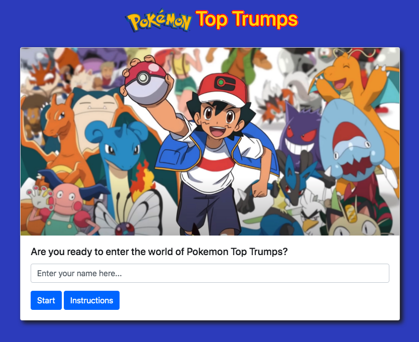
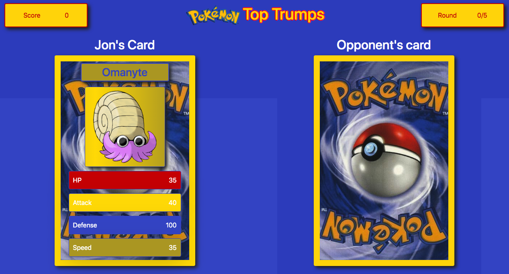
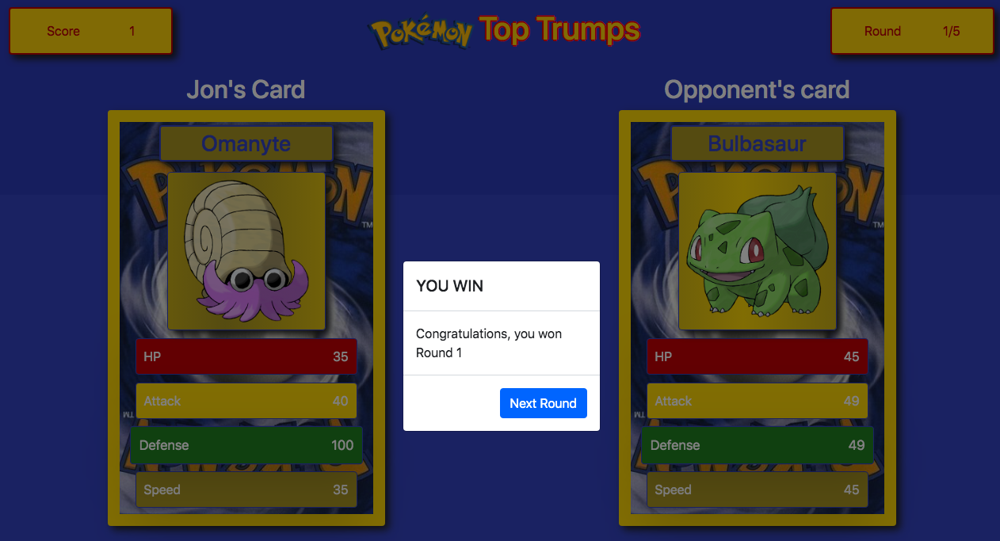
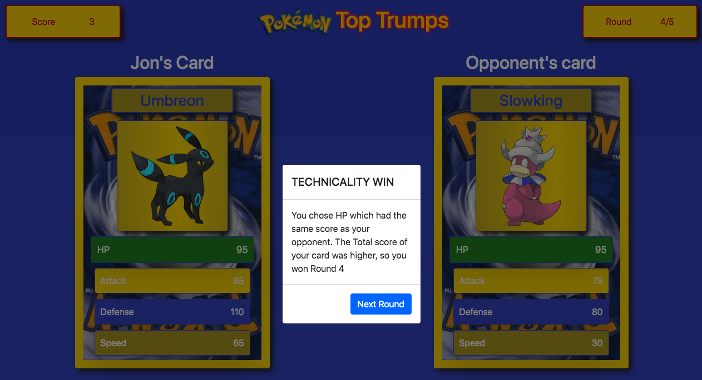
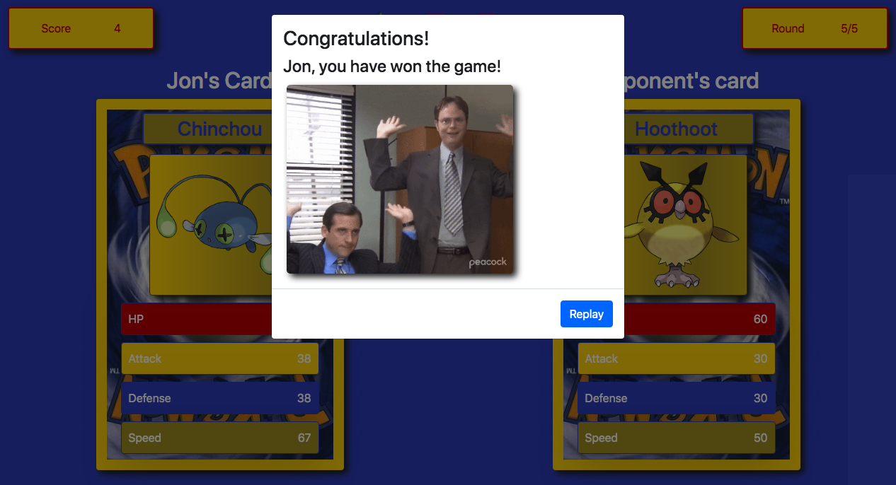

# Pokemon Top Trumps

## A simple Pokemon Top Trumps game app which allows users to pit themselves against the CPU, using JavaScript, jQuery and CSS to interact with the html elements on the page

<!-- TABLE OF CONTENTS -->
<details>
  <summary>Table of Contents</summary>
  <ol>
        <li><a href="#about-the-project">About The Project</a></li>
        <li><a href="#deployment">Deployment / Code Repository</a></li>
        <li><a href="#screenshot">Screenshot</a></li>
        <li><a href="#scope-and-purpose">Scope and Purpose</a></li>
        <li><a href="#usage">Usage</a></li>
        <li><a href="#credits">Credits</a></li>
        <li><a href="#installation">Installation</a></li>
        <li><a href="#pseudocode">Pseudocode</a></li>
        <li><a href="#overview-of-build">Overview of Build</a></li>
        <li><a href="#suggested-future-changes">Suggested Future Changes</a></li>
        <li><a href="#license">License</a></li>
      </ol>
</details>

<!-- About the Project -->

## About the Project

### Deployment / Code Repository

[Live deployment](https://tweetingcynical.github.io/pokemon-top-trumps/)

[Repository](https://github.com/TweetingCynical/pokemon-top-trumps)

### Screenshot

Working version of the site should look like this at standard screen size:






### Scope and Purpose

Build an interactive game app which collects Pokeman character data using the pokeapi, and gives both the user and cpu five cards with which to play. The user selects a category on their own card, and if their category has a better score than their opponent, they win the card.

### Usage

This site and its codeset are for educational purposes only.

### Credits

The following people have all contributed to this app:

- [maclauren](https://github.com/maclauren)
- [Saadu10002](https://github.com/Saadu10002)
- [TweetingCyncical](https://github.com/TweetingCynical)

### Installation

N/A

<!-- Pseudocode and overview of build -->

## Pseudocode

Steps to achieving the working Pokemon Top Trumps App:

GROUP 1 - USING POKEMON API TO POPULATE CARDS

1. On page load, we want to create the HTML elements for each card. Name = h3. Image img (add class "hidden" / and in CSS make that class have attribute of display: hidden)
2. Then for HP, Attack, Defense and speed create a loop using a div (with the id of divHP, divAttach, divDefense, divSpeed so when it is clicked later in the game the whole div can be selected) and then for each category button text element + text element and append to that div.
3. We will display a placeholder/background image on the playerCard and cpuCard (suggest this https://www.google.com/url?sa=i&url=https%3A%2F%2Fbulbapedia.bulbagarden.net%2Fw%2Findex.php%3Ftitle%3DFile%3ACardback.jpg%26oldid%3D0&psig=AOvVaw2_Nmj9bfMXGGMlhEKoFkp3&ust=1675977334187000&source=images&cd=vfe&ved=0CA8QjRxqFwoTCPCS2J_shv0CFQAAAAAdAAAAABAD).
4. When we hit the start button, ask them their name in a modal and save to localstorage. The modal should contain text-area (required), submitBtn and clearBtn
5. Remove class "hidden" for Player card)
6. We want to make an API request for 10 x random Pokemon's data: Name, Image, HP, Attack, Defense, Speed
7. We want to push this data into 2 separate arrays: userCardData and cpuCardData (which will each contain 5 x arrays)
8. Then we need to populate the content on the right hand side of our cards (this will display for the user but not for the cpu until later). These are the id's we will give to the target elements: userPKChar, userPKImg, userHP, userAttack, userDefense, userSpeed + cpuPKChar, cpuPKImg, cpuHP, cpuAttack, cpuDefense, cpuSpeed

GROUP 2 - GAME LOGIC

9. Start a loop to play the game:
   a. Index 0 from the arrays created to select a card for the user
   b. Index 0 from the arrays created to select a card for the cpu
   c. Prompt Player to choose a category (HP, Attack, Defense, Speed) and click it
   d. Display opponent card (remove display class "hidden" fromm cpu card)
   e. Determine the winner based on the chosen category and which category value/integer is higher. The card with the higher value in that category wins. if (userCard > cpuCard === win) else if (userCard < cpuCard === lose) else (userCard = cpuCard === draw)
   f. If win, update the score +1 to the user (in logic and on display). If lose, update the score +1 to the cpu (in logic and display).
   g. If draw, do math to add all category values from userCard and all category values from cpuCard. Then compare, and repeat logic where the card with the higher value in that category wins. if (userCard > cpuCard === win) else if (userCard < cpuCard === lose)
   h. Update the roundNum by +1 (in logic and on display)
   i. Repeat steps a to i until 5 rounds have been played
10. To stop the game, i = userCardData.length and display modal

GROUP 3 - END OF GAME MODAL

11. Display modal should contain an annoucement with userName (from localstorage) + whether user has won or lost + gif + restart button to begin the game again
12. Determine the winner of the game by counting the number of rounds won. The player with the most rounds won, wins. if (userScore > cpuScore === win) else === lose
13. For win, display a 'celebrate' gif. For lose, display a 'thumbs down' gif.
14. Button to restart the game on the modal (function for this). If they press, need to reset the score to 0, round to 0, userCardData to empty and cpuCardData to empty

15. BONUS: Display round data for all rounds in a modal (push choice in 9c to separate array)

16. BONUS: Animate the cards when they are drawn ? e.g. slide in effect

## Overview of Build

Some of the key JavaScript skills being utilised:

- Use of promises and ajax GET method on the Pokémon api data:

```javascript
// Function to be used for fetching data from Pokemon API
function getPokemonData(whoseCardData) {
  // Create optionsIndex filled with 5 random numbers for creating api keys
  const optionsIndex = randomOption(1, 200, 5);
  // Empty arr for storing promises together
  let promises = [];

  // Create promises for all 5 api calls
  for (let index = 0; index < optionsIndex.length; index++) {
    let ajaxData = {
      url: `${partURL}${optionsIndex[index]}`,
      method: "GET",
    };
    let promise = $.ajax(ajaxData);
    // Push each promise into promises array
    promises.push(promise);
  }

  // Get all promises data and store the pokemon information we need for game data
  Promise.all(promises).then((data) => {
    for (let i = 0; i < data.length; i++) {
      whoseCardData.push({
        // Pokemon name
        pkName: data[i].name,
        // HP
        HP: data[i].stats[0]["base_stat"],
        // Attack
        Attack: data[i].stats[1]["base_stat"],
        // Defense
        Defense: data[i].stats[2]["base_stat"],
        // Speed
        Speed: data[i].stats[5]["base_stat"],
        // Pokemon image
        Image: data[i].sprites.other["official-artwork"].front_shiny,
      });
    }
  });
}
```

- Use of a reusable function with passed parameters for the giphy api data fetch:

```javascript
// Function for getting a random GIPHY image
function getGiphyData(state) {
  const giphyData = fetch(
    `${partGiphyURL}?q=${state}&api_key=${giphyAPIKey}&limit=10`
  ).then((response) => response.json());
  return giphyData;
}
```

- Use of a reusable random number function for getting an array of z random numbers, between x and y:

```javascript
// Get a random number for referencing a character and for choosing a random giphy
function randomOption(x, y, z) {
  // Empty array for storing random numbers
  const randomArr = [];

  // For loop to get 5 random numbers. NOTE: Change the multiplier to get a different number of options
  for (let iteration = 0; iteration < z; iteration++) {
    const randomIndex = Math.floor(Math.random() * (y - x + 1)) + x;
    randomArr.push(randomIndex);
  }
  return randomArr;
}
```

- Use of data-choice attributes to get the target click details and use them in the game logic:

```javascript
// Click events for each of the user's card options
function userChoiceEvent(elementID, buttonClass) {
  $(elementID).on("click", function () {
    let userChoice = $(this).attr("data-choice");
    showCPUCard();
    $(document).find($(buttonClass)).parent().parent().addClass("selected");
    checkWinState(userChoice);
    return userChoice;
  });
}
```

- Use of an init function which doubles as a reset game options function to minimise the need to repeat code

```javascript
function init() {
  // Update display
  $("#rounds").addClass("hidden");
  $("#scores").addClass("hidden");
  $("#round").text(`${roundNum}/5`);
  $("#score").text(userScore);
  $(".nextRound").text("Next Round");

  // Hide finalModal and reset cardZone to original state
  $("#finalModal").modal("hide");
  $(".cardZone").addClass("hidden");
  $("#userCardContainer").remove();
  $("#cpuCardContainer").remove();
  $("#win-state").empty().addClass("hidden");
  $("#lose-state").empty().addClass("hidden");

  // Initialise game options
  createCardElements("userCard");
  createCardElements("cpuCard");
  getPokemonData(userCardData);
  getPokemonData(cpuCardData);
  // Call of button click events
  userChoiceEvent("#userCardHPBtn", ".HP");
  userChoiceEvent("#userCardAttackBtn", ".Attack");
  userChoiceEvent("#userCardDefenseBtn", ".Defense");
  userChoiceEvent("#userCardSpeedBtn", ".Speed");
  // Run these functions so that the cards are pre-created with data from the outset.
  checkLocalStorage();
  // Show start screen
  $("#startCard").removeClass("hidden");
}
```

- Use of specific jQuery and CSS combinations to hide and show elements, and to empty child elements:

```javascript
$("#finalModal").modal("hide");
$(".cardZone").addClass("hidden");
$("#userCardContainer").remove();
$("#cpuCardContainer").remove();
$("#win-state").empty().addClass("hidden");
```

### Suggested future changes

- ✅ ~~Refactor the randomOption function to that we can use it for two purposes (multiple random numbers for selecting Pokemon characters, and one single random number with set limits for displaying a different Giphy)~~
- ✅ ~~Add a glittery effect to the background of the card image~~
- ✅ ~~Display card name in upper case, or capitalise~~
- ✅ ~~Add screen shots to instructions modal~~
- Add glow effects to the buttons
- ✅ ~~Add animation effect to the cards so they appear to flip over~~
- Advanced: Display all five user cards in a row, so they can choose which card to play, and then remove that card from their available row once played. This will require choosing cards out of sync, so the logic would need to take into account a different index sequence
- Advanced: Display screen which shows who each card belongs to at the end of the game. This could be acheived by pushing the array index of each card into a new array titled cards won, cards lost.

## License

MIT License

Copyright (c) 2022 TweetingCynical

Permission is hereby granted, free of charge, to any person obtaining a copy of this software and associated documentation files (the "Software"), to deal in the Software without restriction, including without limitation the rights to use, copy, modify, merge, publish, distribute, sublicense, and/or sell copies of the Software, and to permit persons to whom the Software is furnished to do so, subject to the following conditions:

The above copyright notice and this permission notice shall be included in all copies or substantial portions of the Software.

THE SOFTWARE IS PROVIDED "AS IS", WITHOUT WARRANTY OF ANY KIND, EXPRESS OR IMPLIED, INCLUDING BUT NOT LIMITED TO THE WARRANTIES OF MERCHANTABILITY, FITNESS FOR A PARTICULAR PURPOSE AND NONINFRINGEMENT. IN NO EVENT SHALL THE AUTHORS OR COPYRIGHT HOLDERS BE LIABLE FOR ANY CLAIM, DAMAGES OR OTHER LIABILITY, WHETHER IN AN ACTION OF CONTRACT, TORT OR OTHERWISE, ARISING FROM, OUT OF OR IN CONNECTION WITH THE SOFTWARE OR THE USE OR OTHER DEALINGS IN THE SOFTWARE.
